<p align="center">
  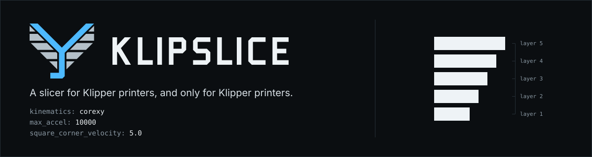
</p>

<p align="center">
  <a href="https://github.com/Extrutex/KlipSlice/actions/workflows/build_all.yml?query=branch%3Adev"></a>
  <a href="LICENSE.txt"></a>
  
  
  
</p>

KLIPSLICE is an open-source 3D printing slicer built exclusively for printers that
run real [Klipper](https://www.klipper3d.org/). It is a hard fork of OrcaSlicer with
every path that does not lead to a Klipper machine removed: one G-code flavor, one
print host, and printer profiles only for machines that verifiably run Klipper.

**Documentation:** <https://extrutex.github.io/KlipSlice-Wiki/> (English and German) ·
in-repo design notes in [`docs/`](docs/)

> KLIPSLICE is an independent project and is not affiliated with or
> endorsed by the Klipper project.

## At a glance

<table>
  <tr>
    <th align="left" width="33%">Machine</th>
    <th align="left" width="33%">Printer side</th>
    <th align="left" width="34%">Slicing</th>
  </tr>
  <tr valign="top">
    <td>
      G-code flavor is always <code>klipper</code>; other flavors are converted on load.<br><br>
      174 printer models with a system profile, each backed by evidence that the machine runs Klipper.<br><br>
      Self-built and converted printers start from <b>Generic Klipper Printer</b> or the <b>Create printer</b> dialog.
    </td>
    <td>
      <a href="https://moonraker.readthedocs.io/">Moonraker</a> is the only print host: upload, print start, discovery on the LAN.<br><br>
      The Device tab is the printer's own Mainsail or Fluidd, with a live status line above it.<br><br>
      <b>Sync filaments</b> reads the filament changer: AFC, Happy Hare, Qidi box, Snapmaker.
    </td>
    <td>
      The OrcaSlicer engine: Arachne walls, tree and normal supports, multi-material, calibration prints.<br><br>
      Precise outer wall as a <b>toolpath shift</b>, so thin features keep their thickness.<br><br>
      Layer progress reported to Klipper's <code>print_stats</code>, no Bambu branches in the G-code path.
    </td>
  </tr>
</table>

## Why a Klipper-only slicer

Klipper executes the limits the G-code sets. Since April 2021 `SET_VELOCITY_LIMIT`
and `M204` are not clamped to the `max_accel`, `max_velocity` and
`square_corner_velocity` in `printer.cfg`: whatever the slicer writes is what the
machine does. The slicer is therefore the last place an envelope violation can be
caught, and KLIPSLICE treats `printer.cfg` as the datum every emitted value is
checked against.

<p align="center">
  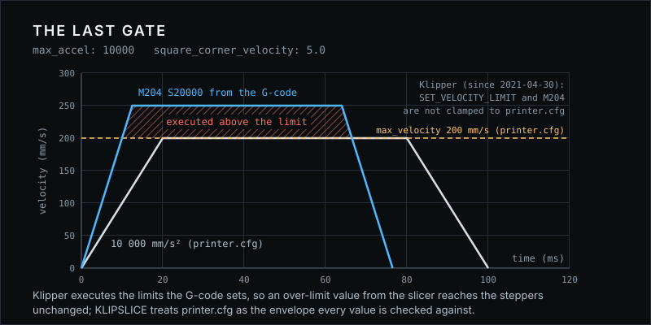
</p>

## The printer side

There is no device model inside the slicer and no agent mirroring the printer. Each
view asks Moonraker when it needs an answer, and the printer's own web UI does
everything richer than a status line. The full design is in
[`docs/HLSD/moonraker-device.md`](docs/HLSD/moonraker-device.md); the user-facing
setup is in [`docs/klipslice/printer-connection.md`](docs/klipslice/printer-connection.md).

<p align="center">
  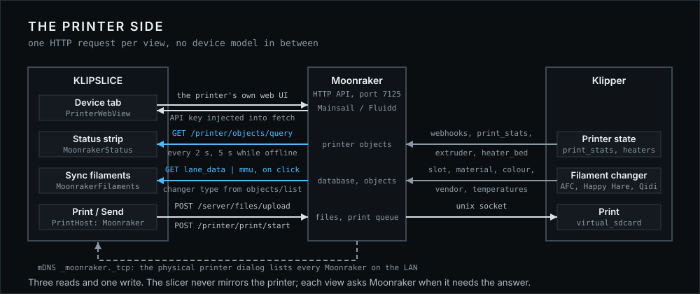
</p>

- **Device tab.** Mainsail or Fluidd, loaded from the printer host with the API key
  injected. Above it one line: link state, what the printer is doing, nozzle and bed
  temperatures, polled every 2 s.
- **Sync filaments.** The sidebar button reads the changer the printer actually has
  (found through `/printer/objects/list`), maps every loaded slot to a filament
  preset by vendor, material and closest colour, and asks before it replaces the
  project's filament list.
- **Print and Send.** One upload, one print start. On Windows a `.local` host name is
  resolved once through mDNS and reused for the whole upload.

<p align="center">
  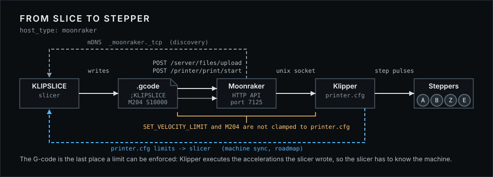
</p>

## Walls that keep thin features

OrcaSlicer's precise outer wall shrinks the outline before the walls are generated, so
every thin feature loses that width and features just above the minimum feature size
are not printed at all. KLIPSLICE adds a second method, `toolpath_shift`: the walls
are generated on the true outline and only the walls behind the outer wall move
inwards, as far as the wall has room. Thick walls come out the same with both methods.

<p align="center">
  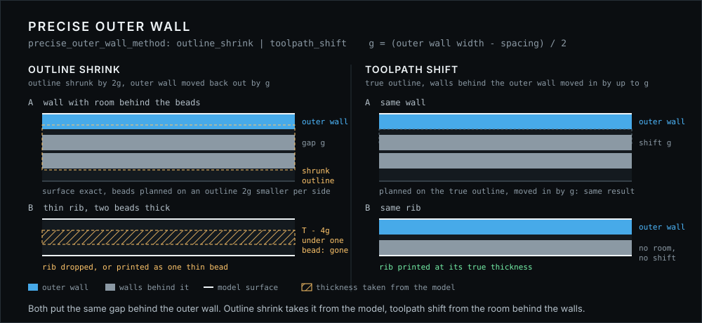
</p>

The setting is **Quality › Precise wall method**. The default stays `outline_shrink`,
so existing projects slice as before.

## The kinematics KLIPSLICE knows

Every machine profile names the Klipper `kinematics` it runs on. The figures show
what moves, what stands still and which motors share a move; the full notes are in
[`docs/klipslice/kinematics.md`](docs/klipslice/kinematics.md).

<table>
  <tr>
    <td width="50%">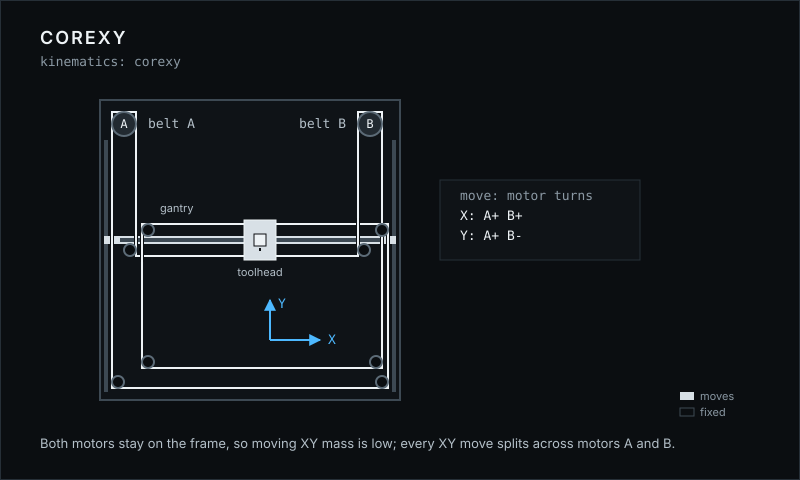</td>
    <td width="50%">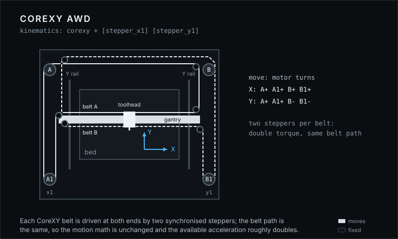</td>
  </tr>
  <tr>
    <td><b>CoreXY</b> &middot; <code>kinematics: corexy</code><br>Voron, RatRig V-Core 3, most self-built machines. Every XY move splits across motor A and motor B.</td>
    <td><b>CoreXY AWD</b> &middot; <code>[stepper_x1] [stepper_y1]</code><br>RatRig V-Core 4, Voron AWD mods. Same belt path, two steppers per belt.</td>
  </tr>
  <tr>
    <td>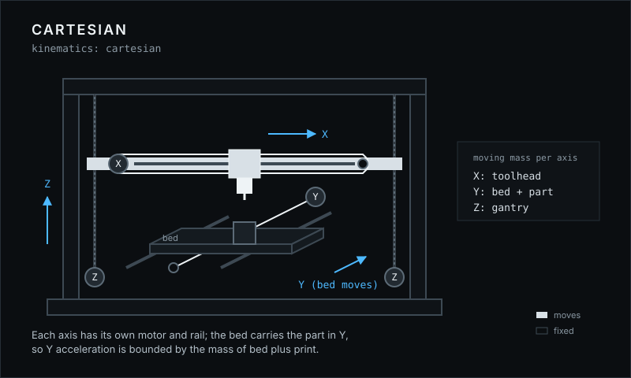</td>
    <td>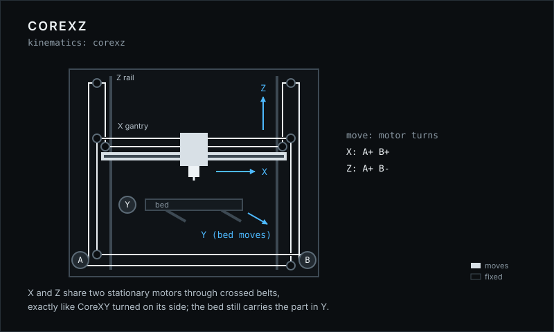</td>
  </tr>
  <tr>
    <td><b>Cartesian</b> &middot; <code>kinematics: cartesian</code><br>Prusa-i3 layout, Ender conversions. Y acceleration is bounded by the mass of bed plus print.</td>
    <td><b>CoreXZ</b> &middot; <code>kinematics: corexz</code><br>Voron Switchwire, Ender 5 conversions. CoreXY turned on its side.</td>
  </tr>
  <tr>
    <td>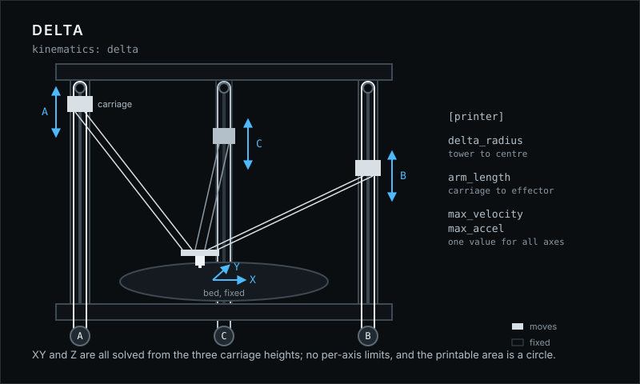</td>
    <td>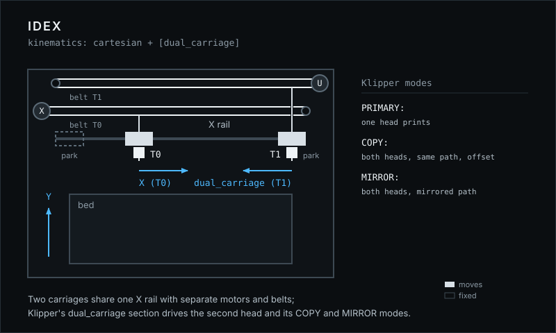</td>
  </tr>
  <tr>
    <td><b>Delta</b> &middot; <code>kinematics: delta</code><br>FLSun V400, T1 and S1, DeltaMaker. One velocity and acceleration limit for all axes, circular bed.</td>
    <td><b>IDEX</b> &middot; <code>[dual_carriage]</code><br>RatRig V-Core 4 IDEX. Two heads on one rail; Klipper's COPY and MIRROR modes print two parts at once.</td>
  </tr>
</table>

## What left with the fork

| Gone | Stays |
|---|---|
| OctoPrint, PrusaLink, Duet, Creality, Elegoo, Flashforge and the cloud print hosts | Moonraker, with Bonjour discovery |
| The Bambu device model, printer agents, AMS mapping and the multi-machine pages | One status line and the printer's own web UI |
| Bambu network plug-in, login, model mall, telemetry, FFmpeg camera streams | The slicing engine, presets and calibration prints |
| Profiles for printers that do not run Klipper | 174 profiles with per-model evidence in [`printer-firmware.json`](docs/klipslice/printer-firmware.json) |

KLIPSLICE uses its own binaries and its own data directory and never reads or
changes an installed OrcaSlicer.

## Status and roadmap

**Pre-alpha.** There are no releases and no installers yet. Settings, profiles
and file formats can still change without migration. Do not rely on KLIPSLICE for
prints that matter. Every push is built for Windows, macOS and Linux and runs the
unit tests.

Planned, not implemented:

- **Machine sync.** Read the live Klipper configuration through Moonraker
  (`max_accel`, `max_velocity`, `square_corner_velocity`,
  `minimum_cruise_ratio`, input shaper) and plan against the real limits of the
  connected printer instead of values typed into a profile.
- **Klipper-accurate print time.** Estimate print time with Klipper's own motion
  model instead of a generic approximation.
- **Native adaptive mesh.** Probe only the area that is actually printed, without
  separate macro packages.

## Build from source

Every platform builds in two steps: first the dependencies (`deps/`, built once
and reused), then the slicer. The dependency build takes a long time and needs
several gigabytes of disk space. Run any build script with `-h` for all options.

```bash
git clone https://github.com/Extrutex/KlipSlice.git
cd KlipSlice
```

<details>
<summary><b>Windows</b> · Visual Studio 2019, 2022 or 2026, CMake, Perl, Git</summary>

```bat
build_win.bat -d
build_win.bat -s
```

Output: `build\src\Release\klipslice.exe`
</details>

<details>
<summary><b>macOS</b> · Xcode or the Command Line Tools, CMake 3.31, gettext</summary>

CMake 4.x currently breaks the dependency build; use CMake 3.31. With the Command
Line Tools only (no full Xcode), export the SDK path first:

```bash
export SDKROOT=$(xcrun --show-sdk-path)
```

Then build the dependencies and the slicer with the Ninja generator:

```bash
./build_release_macos.sh -dx
./build_release_macos.sh -sx
```

Output: `build/<arch>/OrcaSlicer/KLIPSLICE.app` (`<arch>` is `arm64` or `x86_64`)
</details>

<details>
<summary><b>Linux</b> · more than 10 GiB of memory and free disk space</summary>

```bash
./build_linux.sh -u      # install system dependencies (asks for sudo)
./build_linux.sh -dsi    # dependencies, slicer and AppImage
```

Output: `build/package/bin/klipslice` and `build/KLIPSLICE_Linux_V<version>.AppImage`
</details>

Tests are built with `-t` (Linux), `-T` (macOS) or `--run-tests` (Windows); see
[`tests/AGENTS.md`](tests/AGENTS.md) for the suites.

## Contributing

KLIPSLICE has a single maintainer. Bug reports are welcome; code changes are
accepted only after they were agreed in an issue first. See
[CONTRIBUTING.md](CONTRIBUTING.md).

## Credits and license

KLIPSLICE is based on [OrcaSlicer](https://github.com/OrcaSlicer/OrcaSlicer) by
SoftFever and the OrcaSlicer contributors. OrcaSlicer is based on
[Bambu Studio](https://github.com/bambulab/BambuStudio) by Bambu Lab, which is
based on [PrusaSlicer](https://github.com/prusa3d/PrusaSlicer) by Prusa Research,
which comes from [Slic3r](https://github.com/Slic3r/Slic3r) by Alessandro
Ranellucci and the RepRap community. KLIPSLICE would not exist without their work.

KLIPSLICE is licensed under the **GNU Affero General Public License, version 3**.
See [LICENSE.txt](LICENSE.txt). Anyone who distributes KLIPSLICE, modified or not,
must make the corresponding source code available under the same terms.
